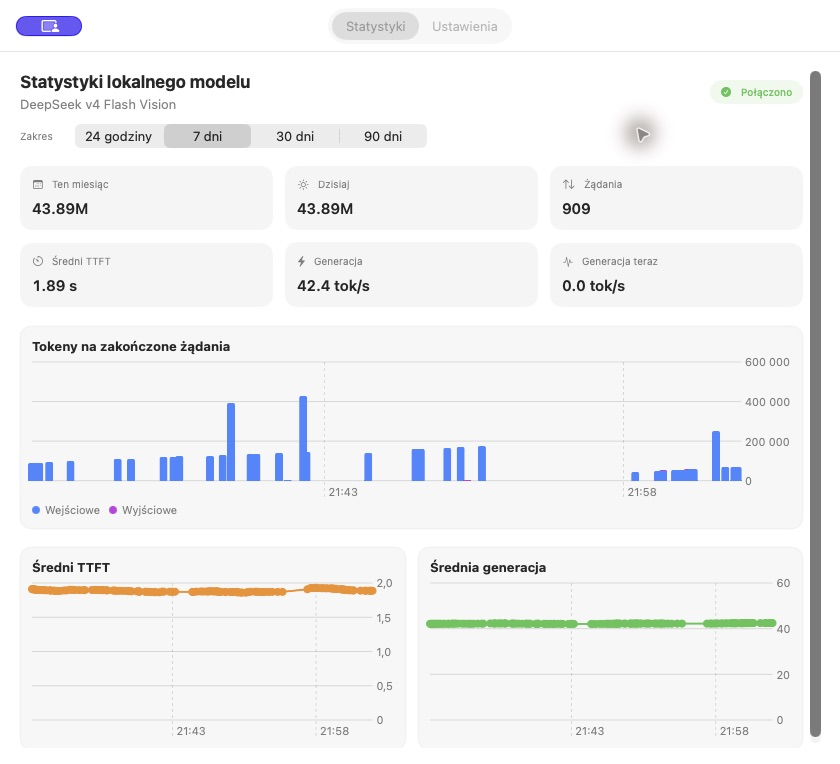

# Local LLM Usage for macOS

A lightweight native menu-bar monitor for OpenAI-compatible local model servers that expose vLLM Prometheus metrics.

Local LLM Usage shows total input/output tokens, request counts, average time to first token (TTFT), average decode speed, and live generation throughput. It stores privacy-preserving history locally and includes native Swift Charts.



## Highlights

- Native macOS menu-bar interface
- Live generation throughput sampled every 1–30 seconds
- Daily and monthly token accounting
- TTFT and generation-speed charts
- Automatic model-name discovery from vLLM metrics
- Polish and English interface
- Configurable HTTP/HTTPS metrics endpoint
- Local JSON export
- No analytics, cloud account, prompt logging, or response logging

## Requirements

- macOS 14 or newer
- Apple Silicon or Intel Mac
- Xcode Command Line Tools with Swift
- A reachable `/metrics` endpoint containing vLLM Prometheus metrics

The default endpoint is `http://127.0.0.1:8000/metrics`. Remote hosts are supported; change the endpoint in **Open Dashboard → Settings**.

## Metrics used

The app currently reads:

- `vllm:prompt_tokens_total`
- `vllm:generation_tokens_total`
- `vllm:request_success_total`
- `vllm:time_to_first_token_seconds_sum`
- `vllm:time_to_first_token_seconds_count`
- `vllm:request_decode_time_seconds_sum`

Live generation is calculated from the change in `generation_tokens_total` between polls. With concurrent requests, it represents aggregate endpoint throughput.

## Build

```bash
./build.sh
```

The signed development build is written to `build/Local LLM Usage.app`.

Install it locally:

```bash
ditto "build/Local LLM Usage.app" "/Applications/Local LLM Usage.app"
open -a "/Applications/Local LLM Usage.app"
```

The build script uses ad-hoc signing. For redistribution and reliable WidgetKit discovery, use an Apple Developer certificate and your own bundle identifiers/application group.

## How accounting works

The app polls cumulative Prometheus counters and stores only their deltas. It handles counter resets without modifying the model server. Statistics are shared across every client using the monitored endpoint; the app does not identify individual applications.

History points contain only timestamps, numeric counters, TTFT, and throughput. Prompt and response content is never collected.

## Language

Choose **Automatic**, **Polski**, or **English** in Settings. Automatic follows the primary macOS language.

## Known limitations

- Metrics must use the expected vLLM metric names.
- Multiple models exposed by one endpoint are currently aggregated.
- Live throughput is a polling-window estimate, not per-token telemetry.
- Historical per-request charts begin when this version starts collecting history; old aggregate counters cannot reconstruct past requests.
- The bundled WidgetKit extension requires appropriate Apple signing to appear reliably in the widget gallery.

## Privacy and security

See [PRIVACY.md](PRIVACY.md) and [SECURITY.md](SECURITY.md). Avoid exposing an unauthenticated metrics endpoint to untrusted networks; prefer localhost, a private LAN, VPN, or an authenticated reverse proxy.

## Contributing

Contributions are welcome. See [CONTRIBUTING.md](CONTRIBUTING.md).

## License

[MIT](LICENSE)
